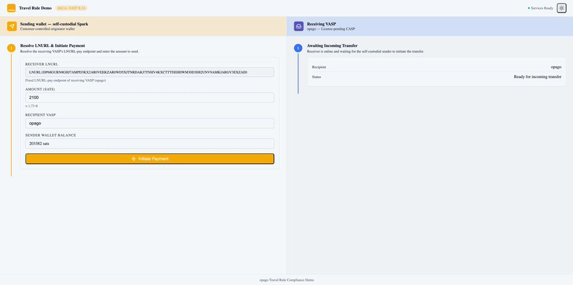

# opago-lightning-travel-rule

[](./LICENSE)
[](https://www.python.org/)
[](https://fastapi.tiangolo.com/)
[](https://eur-lex.europa.eu/legal-content/EN/TXT/?uri=CELEX%3A32023R1114)

A Python reference implementation demonstrating **MiCA-compliant Lightning Network transactions** built by [opago GmbH](https://opago-pay.com), a license-pending CASP (Crypto-Asset Service Provider) under the EU Markets in Crypto-Assets Regulation.

This repository is a working reference build for a simple question: how do you move travel-rule data through a Lightning payment flow without pretending Lightning was designed for that job?

> **Disclaimer:** This module covers the **travel rule / Transfer of Funds Regulation (TFR)** portion of MiCA compliance only. Running a fully compliant CASP requires additional components — for example, transaction monitoring (`opago-tme`), sanction-list screening (`opago-sanction-list`), risk scoring, record-keeping, and reporting modules — which are not included in this repository. Contact [opago GmbH](https://opago.com) for information on the full compliance stack.

> **Status (March 2026):** The local flow in this repository uses funded Spark regtest wallets, LNURL/UMA, and encrypted inline IVMS101 exchange over UMA. The dashboard still uses simulated eAusweis/eIDAS evidence, and live TRISA/TRP/TRUST/GTR interoperability plus production-grade eIDAS verification are not finished yet.

[](docs/assets/Lightning-Travel-Rule-Demo.mov)

---

## Table of Contents

- [Overview](#overview)
- [Key Features](#key-features)
- [Architecture Overview](#architecture-overview)
- [Payment Flow](#payment-flow)
- [Self-Custodial Mode (eIDAS)](#self-custodial-mode-eidas)
- [Quick Start](#quick-start)
- [API Endpoints](#api-endpoints)
- [Configuration](#configuration)
- [Regulatory Context](#regulatory-context)
- [Contributing](#contributing)
- [License](#license)

---

## Overview

Lightning Network payments are instant and cheap — but they are also pseudonymous by default. Under MiCA and the EU Transfer of Funds Regulation, crypto-asset service providers must transmit originator and beneficiary identity data alongside every transfer. This creates a tension: how do you attach verifiable KYC data to a payment channel protocol that was designed to be as lightweight as possible?

The repo ships two separate FastAPI services: a **Sending VASP** and a **Receiving VASP**. You can run them side by side for demos, tests, and customer walkthroughs.

---

## Current state

| Area | Current state |
|---|---|
| **Spark payment rail** | Implemented against local Spark regtest wallets with actual wallet balances and invoice settlement |
| **LNURL / UMA handshake** | Implemented in the local sender/receiver flow |
| **IVMS101 exchange** | Implemented today as encrypted inline IVMS101 attached to the UMA pay request |
| **IVMS101 validation** | Implemented on the receiver side for payload completeness and compliance checks |
| **Desktop eID / eAusweis** | Demo-only. The current dashboard shows the flow, but the real verifier path is not finished |
| **TRISA / TRP / TRUST / GTR** | Adapter work exists in the repository, but the default flow still uses inline UMA exchange |

---

## Key Features

| Feature | Description |
|---|---|
| **MiCA Travel Rule** | IVMS101 originator and beneficiary data attached to UMA pay requests whenever the configured policy requires it, encrypted with JWE ECDH-ES+A256KW |
| **UMA transport** | `UMAMiCAProtocol` uses UMA's standard compliance containers where possible and adds only a small number of custom fields for data UMA does not define |
| **Spark SDK Integration** | Self-custodial Lightning wallet operations powered by `@buildonspark/spark-sdk` |
| **Multi-Protocol Travel Rule** | The repository contains adapter scaffolding for TRISA (Secure Envelopes + GDS), TRP, Coinbase TRUST, and GTR, but the working local POC currently uses direct IVMS101 exchange inside UMA |
| **eIDAS 2.0 Wallet Support** | `EIDASWalletBridge` shows the intended consent/signing flow with simulated evidence; real wallet trust verification and production issuer integration are not finished yet |
| **Compliance Engine** | `ComplianceEngine` evaluates transactions against the active travel-rule policy, validates IVMS101 completeness, screens names, and produces structured `ComplianceDecision` outcomes |
| **Both VASP Roles** | Complete `SendingVASP` (originator) and `ReceivingVASP` (beneficiary) implementations with independent FastAPI apps |
| **IVMS101 Data Model** | Full Pydantic v2 model definitions for the InterVASP Messaging Standard 101, including natural persons, legal persons, geographic addresses, and national identifiers |
| **Audit Logging** | Structured structlog logging with separate audit events for all compliance decisions, travel rule transfers, and eIDAS consent actions |
| **Pydantic-Settings Config** | All environment variables parsed and validated at startup via Pydantic v2 settings models — misconfiguration fails loudly |

---

## Architecture Overview

```
+-----------------------------------------------------------------------+
|                    opago-lightning-travel-rule                        |
|                                                                       |
|  Sending VASP (port 3001)           Receiving VASP (port 3002)        |
|  +--------------------------+       +--------------------------+      |
|  |  SendingVASP             |       |  ReceivingVASP           |      |
|  |                          |       |                          |      |
|  |  +--------------------+  |       |  +--------------------+  |      |
|  |  | UMAMiCA            |  |       |  | UMAMiCA            |  |      |
|  |  | Protocol           |  |       |  | Protocol           |  |      |
|  |  +--------------------+  |       |  +--------------------+  |      |
|  |                          |       |                          |      |
|  |  +--------------------+  |       |  +--------------------+  |      |
|  |  | TravelRule         |  |       |  | TravelRule         |  |      |
|  |  | Manager            |  |       |  | Manager            |  |      |
|  |  +--------------------+  |       |  +--------------------+  |      |
|  |                          |       |                          |      |
|  |  +--------------------+  |       |  +--------------------+  |      |
|  |  | SparkWallet        |  |       |  | SparkWallet        |  |      |
|  |  | Manager            |  |       |  | Manager            |  |      |
|  |  +--------------------+  |       |  +--------------------+  |      |
|  |                          |       |                          |      |
|  |  +--------------------+  |       |  +--------------------+  |      |
|  |  | eIDAS              |  |       |  | Compliance         |  |      |
|  |  | WalletBridge       |  |       |  | Engine             |  |      |
|  |  +--------------------+  |       |  +--------------------+  |      |
|  +--------------------------+       +--------------------------+      |
|              |                               |                        |
|              +---------- (1) LNURL --------->+                        |
|              +<-- (2) Compliance metadata ---+                        |
|              +--- (3) PayReq + IVMS101 ----->+                        |
|              +-- (4) TRISA / TRP / TRUST --->+                        |
|              +<-- (5) Travel Rule ACK -------+                        |
|              +<-- (6) PayResp + Invoice -----+                        |
|              +------ (7) Lightning Pay ----->+                        |
|              +------ (opt) eIDAS VP -------->+                        |
|                                                                       |
|  Protocols: TRISA | TRP | TRUST | GTR | direct                        |
|  Encryption: JWE ECDH-ES+A256KW | Signing: JWS ES256 (secp256k1)      |
+-----------------------------------------------------------------------+
```

Current local POC note: the working demo path uses LNURL/UMA, inline IVMS101, receiver-side IVMS101 validation, and Spark wallet settlement. The TRISA/TRP/TRUST leg and eIDAS VP branch in the diagram are target or experimental paths, not the default live demo flow.

### Source Modules

```
src/opago_mica/
├── types/                     # Pydantic v2 data model definitions
│   ├── ivms101.py             # IVMS101 data model (natural/legal persons, addresses)
│   ├── uma_extended.py        # MiCA-extended UMA types (compliance data, pay req/resp)
│   ├── eidas.py               # eIDAS credential, VP, and proof types
│   ├── uma.py                 # Base UMA types
│   ├── common.py              # Shared utility types
│   └── __init__.py
├── core/                      # Core protocol implementation
│   ├── uma_mica.py            # Customised UMA protocol with MiCA compliance fields
│   ├── compliance_engine.py   # Threshold evaluation, IVMS101 validation, screening
│   └── __init__.py
├── wallet/                    # Spark SDK integration
│   ├── spark_wallet.py        # SparkWalletManager wrapper
│   ├── wallet_factory.py      # Wallet creation factory
│   └── __init__.py
├── compliance/                # Travel Rule protocol adapters
│   ├── travel_rule_provider.py    # Abstract interface + shared types
│   ├── trisa_adapter.py           # TRISA adapter (Secure Envelopes, GDS discovery)
│   ├── trp_adapter.py             # TRP adapter (Travel Rule Protocol)
│   ├── trust_adapter.py           # Coinbase TRUST adapter
│   ├── gtr_adapter.py             # GTR (Global Travel Rule) adapter
│   ├── travel_rule_manager.py     # Protocol negotiation & orchestration
│   └── __init__.py
├── eidas/                     # eIDAS wallet integration
│   ├── eidas_wallet.py        # EUDI wallet bridge with OpenID4VP consent flow
│   └── __init__.py
├── sending/                   # Originator VASP
│   ├── sender.py              # SendingVASP business logic
│   ├── sender_server.py       # FastAPI app (port 3001)
│   └── __init__.py
├── receiving/                 # Beneficiary VASP
│   ├── receiver.py            # ReceivingVASP business logic
│   ├── receiver_server.py     # FastAPI app (port 3002)
│   └── __init__.py
├── config/                    # Pydantic-settings validated configuration
│   └── __init__.py
├── utils/                     # Crypto helpers, structlog logger
│   ├── crypto.py
│   ├── logger.py
│   └── __init__.py
├── __main__.py                # Main entry point (demo runner)
└── __init__.py
```

---

## Payment Flow

The current local flow is:

1. **Sender initiates** — The user submits a payment request to `POST /api/send` with the recipient UMA address (e.g. `$alice@receiver.example.com`) and amount.

2. **LNURL discovery** — `SendingVASP` resolves the recipient's domain via `GET /.well-known/lnurlp/alice` on the Receiving VASP, obtaining the pay endpoint URL, supported currencies, and compliance metadata (KYC status, encryption public key).

3. **Compliance check** — `ComplianceEngine` decides whether the current payment needs travel-rule data under the configured policy. If it does, a full IVMS101 payload is assembled with originator data.

4. **Identity step (demo)** — The dashboard can show a Desktop eID / AusweisApp step, but the current implementation still treats that evidence as simulated. The real verifier path is not finished yet.

5. **UMA pay request** — `UMAMiCAProtocol` constructs a pay request with:
   - IVMS101 originator payload, encrypted with the receiver's JWE public key
   - the standard UMA `payerData.compliance` block carrying `kycStatus`, JWS signature, nonce, and the encrypted travel-rule payload
   - a small number of custom fields only where UMA has no defined field, such as `travelRuleTransferId` and `eidasAttestation`

6. **Receiving VASP validates IVMS101** — The Receiving VASP decrypts the IVMS101 payload, validates its completeness, and runs its own compliance check against MiCA/TFR requirements.

7. **Travel rule data stays inline for the default demo** — The standard local flow keeps the travel-rule payload inline in the UMA exchange. The separate TRISA/TRP/TRUST/GTR adapters are there for future interoperability work, but they are not the default path.

8. **Invoice generation** — After the inline IVMS101 checks succeed, the Receiving VASP generates a Lightning invoice (BOLT11). If the compliance checks fail, no invoice is issued and the payment is blocked.

9. **UMA pay response** — The Receiving VASP returns the BOLT11 invoice wrapped in a UMA pay response to the Sending VASP.

10. **Lightning payment** — `SparkWalletManager` pays the invoice via the Spark SDK. The payment settles on the Lightning Network.

11. **Confirmation** — Both VASPs record the compliance transfer and payment in their respective audit logs.

---

## How this demo uses UMA

The important point is simple: UMA already gives us standard places for identity and compliance data. We use those first.

The three spec chapters that matter here are:

- [UMAD-04: LNURLP response](https://github.com/uma-universal-money-address/protocol/blob/main/umad-04-lnurlp-response.md)
- [UMAD-05: payreq request](https://github.com/uma-universal-money-address/protocol/blob/main/umad-05-payreq-request.md)
- [UMAD-06: payreq response](https://github.com/uma-universal-money-address/protocol/blob/main/umad-06-payreq-response.md)

### What we use from the UMA standard

On the discovery step, the receiver uses the standard UMA `payerData` negotiation block and the standard UMA `compliance` block. That means the sender can learn, in a normal UMA way, that the receiver wants `identifier`, `name`, and `compliance`, and it can also read the receiver's compliance posture from `isSubjectToTravelRule`, `kycStatus`, `signature`, `signatureNonce`, `signatureTimestamp`, and `receiverIdentifier`.

On the pay request itself, we lean on the standard UMA place for compliance exchange: `payerData.compliance`. That is where the sender puts `encryptedTravelRuleInfo`, `travelRuleFormat`, `kycStatus`, `signature`, `signatureNonce`, and the other compliance fields defined by UMAD-05.

On the pay response, we use the standard UMA `pr`, `routes`, `payeeData`, and `umaVersion` fields. Receiver-side compliance data lives under `payeeData.compliance`, which is the slot UMAD-06 already gives us.

### Where we deviate

We carry a few custom fields because UMA does not define them:

- `travelRuleTransferId`
  Used when the travel-rule exchange happened out of band and the pay request only needs to carry the transfer reference.
- `eidasAttestation`
  Used for the transaction-bound eIDAS signature metadata. UMA does not define an eIDAS attestation field.
- `eidasCredentialPresentation` inside `payerData.compliance`
  UMA gives us the compliance container, but it does not define a field for an eIDAS presentation.

### Current request shape on the wire

This is what the demo sends to `POST /api/uma/payreq/:username`:

```json
{
  "payerData": {
    "identifier": "$max@sender.example",
    "name": "Max Mustermann",
    "compliance": {
      "kycStatus": "VERIFIED",
      "signature": "<JWS over pay request payload>",
      "signatureNonce": "6f8d7c1a8c4a5d8b",
      "signatureTimestamp": "2026-03-10T12:00:00Z",
      "encryptedTravelRuleInfo": "<JWE compact token carrying IVMS101 JSON>",
      "travelRuleFormat": "ivms101-2020",
      "eidasCredentialPresentation": "{\"type\":\"VerifiablePresentation\",...}"
    }
  },
  "amount": "2100000",
  "payeeData": {
    "identifier": { "mandatory": false },
    "name": { "mandatory": false },
    "compliance": { "mandatory": false }
  },
  "comment": "travel rule test",
  "travelRuleTransferId": "trisa-in-123",
  "eidasAttestation": {
    "paymentReference": "pay_123",
    "signature": "header.payload.signature",
    "signingCertificate": "-----BEGIN CERTIFICATE-----\\n...\\n-----END CERTIFICATE-----",
    "signedAt": "2026-03-10T12:00:00Z",
    "signatureLevel": "QES"
  },
  "umaVersion": "1.0"
}
```

In this Lightning-only demo, `amount` is sent as a UMA string containing millisats.

### What is inside `encryptedTravelRuleInfo`

That field is a JWE. Once the receiver decrypts it, the payload is plain IVMS101 JSON. In practice it looks like this:

```json
{
  "originator": {
    "originator_persons": [
      {
        "natural_person": {
          "name": [
            {
              "name_identifiers": [
                {
                  "primary_identifier": "Mustermann",
                  "secondary_identifier": "Max",
                  "name_identifier_type": "LEGL"
                }
              ]
            }
          ]
        }
      }
    ],
    "account_number": ["$max@sender.example"]
  },
  "beneficiary": {
    "beneficiary_persons": [
      {
        "natural_person": {
          "name": [
            {
              "name_identifiers": [
                {
                  "primary_identifier": "alice",
                  "name_identifier_type": "LEGL"
                }
              ]
            }
          ]
        }
      }
    ],
    "account_number": ["$alice@receiver.example"]
  }
}
```

### Current response shape on the wire

The receiver answers in the standard UMA response shape:

```json
{
  "pr": "lnbcrt21u1...",
  "routes": [],
  "payeeData": {
    "identifier": "$alice@receiver.example",
    "name": "Alice Demo",
    "compliance": {
      "signature": "<receiver JWS>",
      "signatureNonce": "8de8b18d3b0f4cdb",
      "signatureTimestamp": "2026-03-10T12:00:02Z"
    }
  },
  "umaVersion": "1.0"
}
```

---

## Self-Custodial Mode (eIDAS)

For users who hold their identity in an **EU Digital Identity Wallet (EUDIW)** — such as the wallet apps being rolled out by EU member states under Regulation (EU) 2024/1183 — this implementation provides a bridge that allows them to sign travel rule data themselves instead of relying solely on the VASP's KYC records.

> **Current status:** This section describes the intended architecture. The current build does not complete a production eIDAS / Ausweis verification round-trip. The demo uses simulated identity evidence to exercise the consent and compliance UX.

### When eIDAS signing is activated

eIDAS wallet signing is **not** used by default. It is only activated when **all three** of the following conditions are met:

1. **The Receiving VASP requests identity verification** — The receiver's `GET /api/compliance/requirements` endpoint returns `requiresEidasSignature: true`.
2. **The user has an eIDAS wallet configured** — `EIDAS_ENABLED=true` in the environment and an issuer URL is set.
3. **The user explicitly approves data sharing** — `EIDASWalletBridge.requestConsent()` presents the requested attributes to the user; only an affirmative approval proceeds.

### Selective disclosure

The EUDI wallet bridge implements selective disclosure: only the attributes specifically requested by the Receiving VASP (e.g. legal name, date of birth, country of residence) are included in the Verifiable Presentation. No additional credential data is exposed.

### Technical flow

```
Sender App          EIDASWalletBridge       User's EUDI Wallet
    │                      │                        │
    │──requestConsent()───▶│                        │
    │                      │──OpenID4VP request────▶│
    │                      │                        │ (user reviews
    │                      │                        │  requested attrs)
    │                      │◀──VP Token (JWS/ES256)─│
    │◀─ConsentResult───────│                        │
    │                      │                        │
    │  [includes VP Token in UMA pay request]
```

In the finished architecture, the resulting Verifiable Presentation would be a W3C VC Data Model 2.0 document signed with ES256, containing the approved IVMS101 attributes. The Receiving VASP would then verify the signature and certificate chain against trusted EU member-state CAs. That verifier path is not implemented in this repository yet.

---

## Quick Start

### Prerequisites

- Python 3.12+
- Node.js 18+ for the local Spark bridge
- A Spark mnemonic or seed if you want a persistent wallet identity (optional for local testing)
- TRISA / TRP / TRUST / GTR credentials only if you are experimenting with the unfinished adapter paths; they are not required for the default local POC

### Installation

```bash
git clone https://github.com/Opago-Pay/opago-lightning-travel-rule.git
cd opago-lightning-travel-rule
npm install
pip install -e ".[dev]"
```

### Configuration

```bash
cp .env.example .env
# Edit .env with your values (see Configuration section below)
```

### Running

```bash
# Run both Sender and Receiver together (demo mode)
python -m opago_mica

# Run Sender only
python -m opago_mica.sending.sender_server

# Run Receiver only
python -m opago_mica.receiving.receiver_server

# Run tests
pytest

# Run tests with coverage
pytest --cov=opago_mica

# Lint / type-check
ruff check src/
mypy src/

# Prepare sender/receiver Spark mnemonics and top up the sender on regtest
uv run python scripts/testing/prepare_test_wallets.py --format json

# Start the local split-screen demo
scripts/testing/start_test_transaction.sh
```

The demo runner at `src/opago_mica/__main__.py` starts both VASPs and executes sample payments against a real Spark wallet. `scripts/testing/prepare_test_wallets.py` keeps demo mnemonics in a local `.demo-state/` directory unless you provide `SENDER_SPARK_MNEMONIC` and `RECEIVER_SPARK_MNEMONIC` explicitly through the environment.

To compile TRISA gRPC protos (for GDS Lookup and Transfer): run `./scripts/build/compile_trisa_protos.sh` from the repo root. This clones the trisacrypto/trisa proto tree into `build/trisa-proto` and generates Python stubs in `src/opago_mica/compliance/trisa_grpc/`.

---

## API Endpoints

### Sending VASP (default port 3001)

| Method | Path | Description |
|--------|------|-------------|
| `POST` | `/api/send` | Initiate a MiCA-compliant Lightning payment |
| `GET` | `/api/balance` | Spark wallet balance |
| `GET` | `/api/transactions` | Payment transaction history |
| `GET` | `/api/compliance/transfers` | Travel rule transfer log |
| `GET` | `/api/audit` | Compliance audit events |
| `GET` | `/api/health` | Health check |
| `POST` | `/api/travel-rule/callback` | Async travel rule response callback |
| `GET` | `/.well-known/uma-configuration` | UMA VASP discovery document |
| `GET` | `/.well-known/lnurlp/:username` | LNURL-pay endpoint |

#### `POST /api/send` — Request body

```json
{
  "receiverAddress": "$alice@receiver.example.com",
  "amount": 50000,
  "currency": "SAT",
  "note": "Invoice payment"
}
```

### Receiving VASP (default port 3002)

| Method | Path | Description |
|--------|------|-------------|
| `GET` | `/.well-known/lnurlp/:username` | LNURL-pay discovery |
| `GET` | `/.well-known/uma-configuration` | UMA VASP configuration |
| `POST` | `/api/uma/payreq/:username` | Handle UMA pay request (IVMS101 + invoice) |
| `POST` | `/api/travel-rule/incoming` | Receive generic travel rule data |
| `POST` | `/api/travel-rule/trp` | TRP protocol endpoint |
| `POST` | `/api/travel-rule/trisa` | TRISA protocol endpoint |
| `GET` | `/api/compliance/requirements` | Compliance requirements (incl. eIDAS flag) |
| `GET` | `/api/compliance/transfers` | Incoming transfer log |
| `GET` | `/api/audit` | Compliance audit events |
| `GET` | `/api/health` | Health check |

---

## Configuration

All variables are documented in `.env.example`. Copy it to `.env` before running. Configuration is loaded and validated at startup via [pydantic-settings](https://docs.pydantic.dev/latest/concepts/pydantic_settings/).

| Variable | Default | Description |
|---|---|---|
| `SENDER_SPARK_MNEMONIC` | — | Optional BIP-39 mnemonic for the sender Spark wallet |
| `RECEIVER_SPARK_MNEMONIC` | — | Optional BIP-39 mnemonic for the receiver Spark wallet |
| `SENDER_SPARK_MASTER_KEY` | — | Optional raw sender wallet seed/master key |
| `RECEIVER_SPARK_MASTER_KEY` | — | Optional raw receiver wallet seed/master key |
| `SPARK_NETWORK` | `MAINNET` | Spark network: `MAINNET`, `REGTEST`, or `SIGNET` |
| `VASP_DOMAIN` | — | Public domain of this VASP (e.g. `vasp.example.com`) |
| `UMA_SIGNING_KEY` | — | PEM-encoded EC P-256 PKCS#8 private key for UMA request signing |
| `UMA_ENCRYPTION_KEY` | — | PEM-encoded EC P-256 PKCS#8 private key for JWE payload encryption |
| `VASP_LEGAL_NAME` | — | Legal name of this VASP |
| `VASP_LEI_CODE` | — | 20-character LEI code (optional, recommended for B2B) |
| `VASP_JURISDICTION` | `DE` | ISO 3166-1 alpha-2 jurisdiction of this VASP |
| `UMA_VERSION` | `1.0` | UMA protocol version |
| `TRAVEL_RULE_THRESHOLD_EUR` | implementation-configured | Controls when this deployment requires travel-rule handling. Local demos often override it to force the flow on every transfer. |
| `PORT` | `3000` | HTTP port for the server |
| `HOST` | `0.0.0.0` | Bind address |
| `BASE_URL` | — | Public base URL of this service (e.g. `https://vasp.example.com`) |
| `EIDAS_ENABLED` | `false` | Enable eIDAS wallet integration |
| `EIDAS_ISSUER_URL` | — | URL of the eIDAS-compliant credential issuer (required when `EIDAS_ENABLED=true`) |
| `EIDAS_WALLET_ID` | — | Identifier for the eIDAS wallet instance |
| `LOG_LEVEL` | `info` | structlog log level: `debug`, `info`, `warn`, or `error` |
| `JSON_LOGS` | `false` | Emit structured JSON logs (auto-enabled in production) |
| `OTEL_ENDPOINT` | — | Optional OpenTelemetry collector endpoint |
| `DATABASE_URL` | `sqlite:./data/opago-mica.db` | SQLite path or PostgreSQL connection string |
| `DATABASE_MAX_CONNECTIONS` | `5` | Max DB connections (PostgreSQL) |
| `APP_ENV` | `development` | Application environment: `development`, `test`, or `production` |
| `TRISA_CERTIFICATE_PATH` | — | Path to TRISA mTLS certificate (PEM). When set with the other TRISA vars, the TRISA adapter is auto-registered. |
| `TRISA_PRIVATE_KEY_PATH` | — | Path to TRISA private key (PEM). |
| `TRISA_DIRECTORY_ENDPOINT` | — | TRISA GDS endpoint (e.g. `api.testnet.directory:443` for testnet). |
| `TRISA_VASP_ID` | — | This VASP's TRISA identifier (e.g. `trisa-test.opago.com`). |

---

## Regulatory Context

### MiCA — Regulation (EU) 2023/1114

The Markets in Crypto-Assets Regulation entered into full effect on 30 December 2024. It establishes a harmonised EU framework for crypto-asset service providers (CASPs), covering authorisation, prudential requirements, conduct of business, and market abuse prevention. VASPs handling Lightning payments qualify as CASPs under Title V.

### EU Transfer of Funds Regulation — Regulation (EU) 2023/1113

The revised Transfer of Funds Regulation (TFR) extends FATF Recommendation 16 (the "Travel Rule") to crypto-assets from 30 December 2024. In practice, it is the rule set behind the originator and beneficiary data this repository moves around as IVMS101.

### FATF Travel Rule — Recommendation 16

The Financial Action Task Force Travel Rule requires virtual asset service providers (VASPs) to obtain, hold, and transmit required originator and beneficiary information alongside virtual asset transfers. The EU TFR implements this at the legislative level with enforcement by national competent authorities.

### eIDAS 2.0 — Regulation (EU) 2024/1183

The revised eIDAS regulation mandates that EU member states provide citizens with a free EU Digital Identity Wallet. In this repository, `EIDASWalletBridge` is the placeholder for that future integration. The real verifier backend, trust-store validation, and production eIDAS acceptance path are not finished yet.

---

## Contributing

Contributions, bug reports, and suggestions are welcome. Please open an issue or pull request on GitHub.

1. Fork the repository
2. Create a feature branch: `git checkout -b feature/your-feature`
3. Commit your changes with clear messages
4. Open a pull request against `main`

Please ensure all code passes linting (`ruff check src/`), type-checking (`mypy src/`), and tests pass (`pytest`) before submitting.

---

## License

Copyright (c) 2026 [opago GmbH](https://opago-pay.com)

This project is licensed under the **PolyForm Small Business License 1.0.0** with the additional **PolyForm Perimeter 1.0.0** restriction.

In summary:

- **Small businesses** (fewer than 100 people and under $1M revenue) may use, modify, and distribute this software freely.
- **Non-compete**: You may not use this software to build a product that competes with it.
- **Larger organisations** should contact opago GmbH for a commercial license.

See [LICENSE](./LICENSE) for the full legal text and [THIRD-PARTY-LICENSES](./THIRD-PARTY-LICENSES) for open-source dependency attributions (note: this file reflects the Python dependency set and needs updating when dependencies change).
